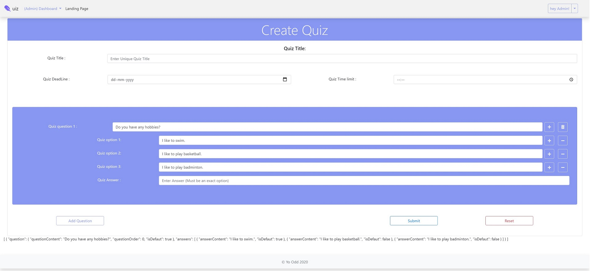
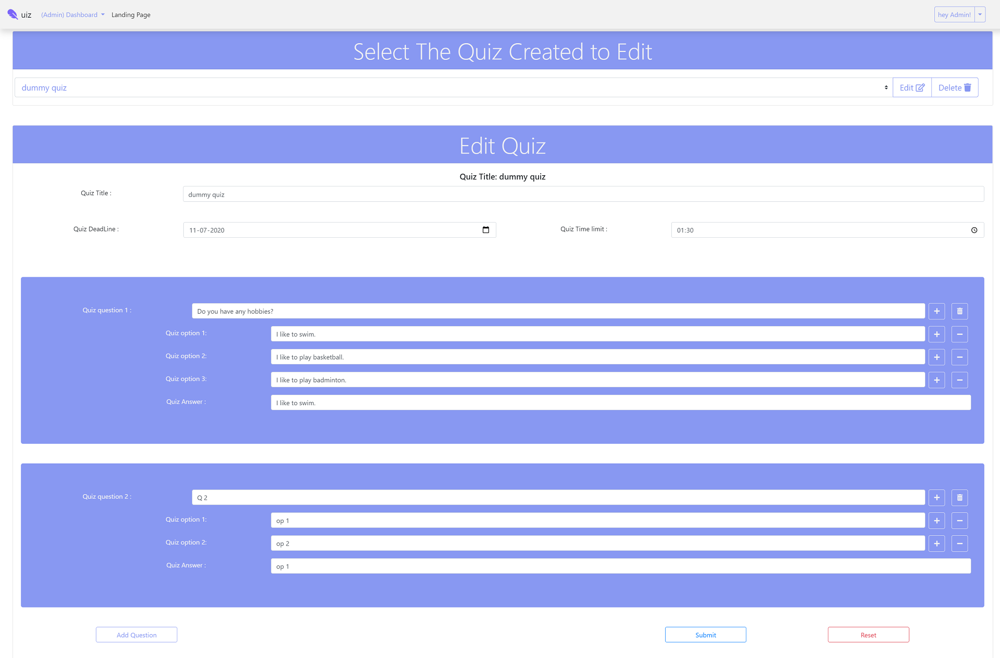
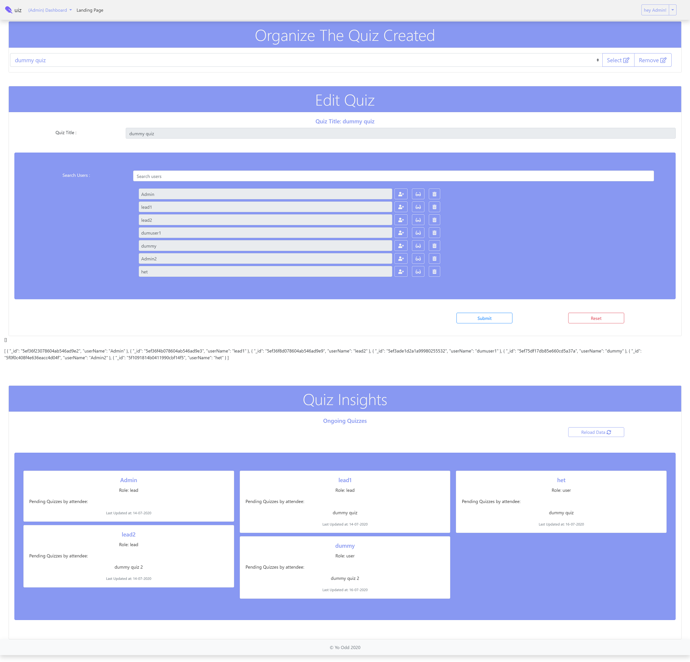
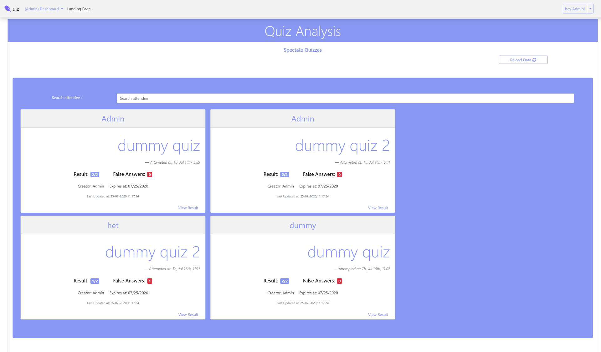
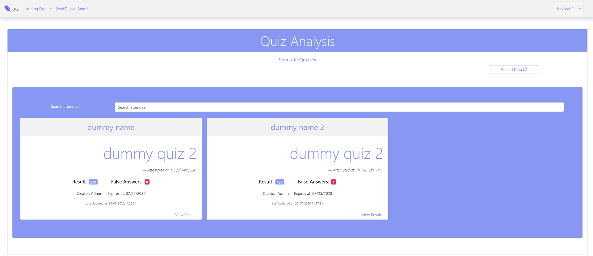
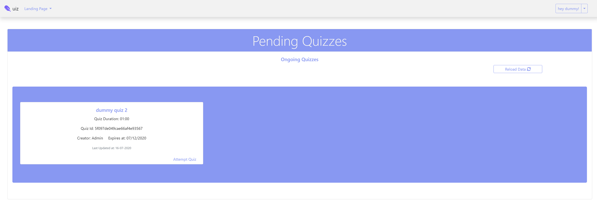
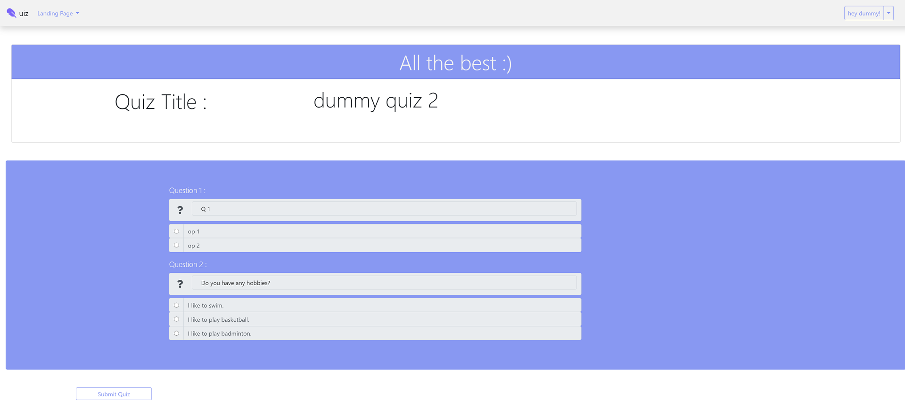
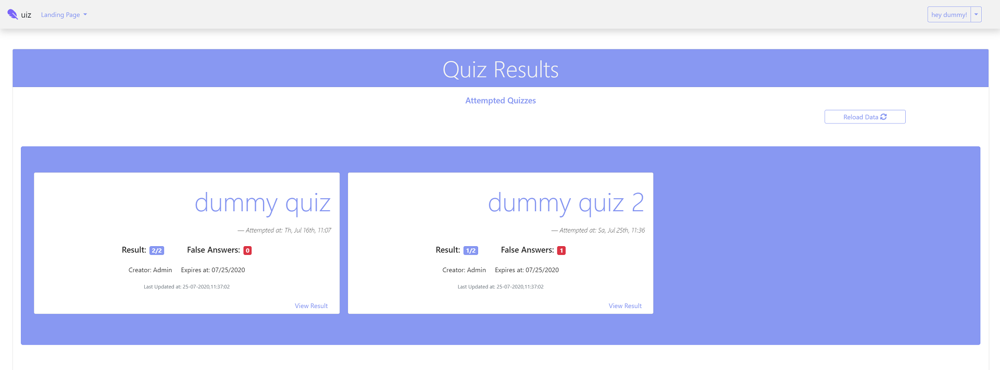

# Quiz-WebApp
The basic mini project for organizing and appearing for Quizzes 
_(I understand it is cumbersome to demonstrate the project through images, will update the readme with screen grab of project, probably will share the youtube link)_

Contact :yogeshcod@gmail.com

## Briefs 
So this is the mini project i was doing during my internship. (also worth mentioning it's quarantine edition XD)
### The topic is simple, just Quiz Application with three roles user can use the application as
-  **Admin** : creates , organise and share the Quiz among registered users 
-  **Lead** : Spectates the shared the Quiz and analyze the performance of attendees belonging to the team he/she is assigned to...
-  **Attendee (User)** : The User can attend the Quiz before it expires and gets the result after submitting the Quiz he/she participated in.

## The frameworks, back-end technologies, Database and packages used are listed below...

 
 
 
 
 
 
 
 
 
 
 
 
 
 

## Here's some sneek peaks from the Project...

### Common Log-in module protected by auth-Guard services 

### Admin Dashboard...

  
    
 
  
    
 
  
    
 
      

### Lead Dashboard...
The team lead can analyze overall performances of team members in asigned quizzes

      

### User Landing Page...

  
    
 
  
    
 
      

